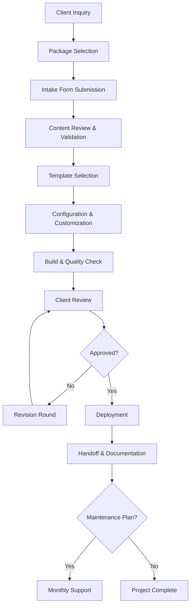
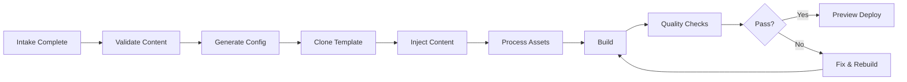

# Scalable Portfolio Building System

## Executive Summary

A comprehensive system to build and deliver **5+ professional portfolios per week** while maintaining high quality standards for performance, SEO, and mobile responsiveness. Designed for solo operation with future delegation capability.

---

## System Architecture Overview



---

## Proposed Changes

### Phase 1: Foundation (Week 1-2)

#### Component 1: Template System

Create a monorepo containing all industry-specific templates:

| Template | Target Industry | Base Design | Key Features |
|----------|-----------------|-------------|--------------|
| `legal-portfolio` | Lawyers, Attorneys | Dark blue + gold | CV download, practice areas, testimonials |
| `medical-portfolio` | Doctors, Specialists | Clean white + teal | Credentials, services, appointment CTA |
| `creative-portfolio` | Designers, Photographers | Minimal + accent | Gallery, project showcase, contact |
| `finance-portfolio` | CPAs, Consultants | Navy + silver | Services, certifications, case studies |
| `tech-portfolio` | Developers, Engineers | Modern dark | Projects, skills, GitHub integration |

##### [NEW] Template Monorepo Structure
```
portfolio-templates/
├── packages/
│   ├── core/                    # Shared components & utilities
│   │   ├── components/          # Navbar, Footer, Contact, etc.
│   │   ├── hooks/               # useScrollPosition, useMobileMenu
│   │   ├── styles/              # Base CSS, animations
│   │   └── utils/               # Helpers, validators
│   │
│   ├── legal-portfolio/         # Lawyer template
│   ├── medical-portfolio/       # Doctor template
│   ├── creative-portfolio/      # Designer template
│   ├── finance-portfolio/       # CPA template
│   └── tech-portfolio/          # Developer template
│
├── tools/
│   ├── generator/               # CLI to scaffold new projects
│   ├── validator/               # Quality checks & benchmarks
│   └── deployer/                # Automated deployment scripts
│
└── docs/
    ├── client-guides/           # Handoff documentation
    └── internal/                # Process documentation
```

---

#### Component 2: Configuration-Driven Customization

Each client site uses a single config file for all customizations:

##### [NEW] `client.config.ts`
```typescript
export const clientConfig = {
  // Branding
  name: "Alexander Mitchell",
  tagline: "Corporate & Business Law Attorney",
  primaryColor: "#2B3A51",
  accentColor: "#D4AF37",
  
  // Contact
  email: "alex@lawfirm.com",
  phone: "+1 (555) 123-4567",
  location: "New York, NY",
  
  // Features (toggle on/off)
  features: {
    videoBackground: true,
    cvDownload: true,
    testimonials: true,
    contactForm: true,
    blog: false,
    appointmentBooking: false,
  },
  
  // SEO
  seo: {
    title: "Alexander Mitchell - Corporate Lawyer",
    description: "20+ years of corporate law experience...",
    keywords: ["corporate lawyer", "business law", "NYC attorney"],
  },
  
  // Content (injected from intake form)
  content: {
    hero: { ... },
    about: { ... },
    services: [ ... ],
    testimonials: [ ... ],
  }
}
```

---

### Phase 2: Client Workflow (Week 2-3)

#### Component 3: Intake System

##### Package Tiers

| Feature | Basic | Professional | Premium |
|---------|-------|--------------|---------|
| **Price Range** | $ | $$ | $$$ |
| **Sections** | 4 | 6 | 8+ |
| **Revision Rounds** | 2 | 3 | 5 |
| **Custom Imagery** | Client-provided | 1 AI-generated | 3 AI-generated |
| **Video Background** | ❌ | ✅ | ✅ |
| **CV/Resume** | ❌ | ✅ | ✅ Styled |
| **Contact Form** | Basic | Advanced | Custom |
| **SEO Setup** | Basic | Enhanced | Full |
| **Delivery Time** | 5-7 days | 4-5 days | 3-4 days |
| **Maintenance** | Optional add-on | Optional add-on | 1 month included |

##### [NEW] Intake Form Structure

```yaml
# intake-form-template.yaml
sections:
  - personal:
      - full_name (required)
      - professional_title (required)
      - tagline (optional)
      - bio_short (required, 150 chars)
      - bio_long (required, 500 chars)
      
  - contact:
      - email (required)
      - phone (optional)
      - location (required)
      - website (optional)
      - social_links[]
      
  - branding:
      - primary_color (with suggestions)
      - secondary_color (with suggestions)
      - logo_upload (optional)
      - profile_photo (required)
      - cover_image (optional)
      
  - content:
      - services[] (min 3, max 8)
      - experience[] (work history)
      - education[]
      - certifications[]
      - testimonials[] (optional)
      
  - assets:
      - video_upload (Professional+)
      - cv_upload (optional)
      - gallery_images[] (optional)
```

---

#### Component 4: Content Validation Pipeline

Automated checks before build:

| Check | Rule | Action if Failed |
|-------|------|------------------|
| Bio length | 150-500 chars | Request revision |
| Image quality | Min 800x600, < 5MB | Resize/compress |
| Video format | MP4, < 10MB, < 30s | Convert/compress |
| Required fields | All marked fields | Block until fixed |
| Color contrast | WCAG AA | Suggest adjustment |

---

### Phase 3: Automation (Week 3-4)

#### Component 5: Build Pipeline



##### [NEW] CLI Generator Tool
```bash
# Create new client project
portfolio create --template=legal --client="john-doe" --package=professional

# Inject content from intake form
portfolio inject --config=./john-doe.config.json

# Run quality checks
portfolio validate --all

# Deploy to preview
portfolio deploy --preview

# Deploy to production
portfolio deploy --prod
```

---

#### Component 6: Quality Assurance Automation

##### Lighthouse Benchmarks (Non-Negotiable)

| Metric | Minimum Score | Target Score |
|--------|---------------|--------------|
| Performance | 85 | 95+ |
| Accessibility | 90 | 100 |
| Best Practices | 90 | 100 |
| SEO | 95 | 100 |

##### Automated Checks
```bash
portfolio validate
# ✓ Lighthouse Performance: 92/100
# ✓ Lighthouse Accessibility: 100/100
# ✓ Lighthouse Best Practices: 100/100
# ✓ Lighthouse SEO: 100/100
# ✓ Mobile Responsive: Passed
# ✓ Image Optimization: All < 200KB
# ✓ Video Optimization: < 2MB
# ✓ Load Time (4G): 2.1s
# ✓ Core Web Vitals: Passed
```

---

### Phase 4: Delivery & Maintenance (Week 4)

#### Component 7: Client Handoff Package

Each client receives:

| Document | Purpose |
|----------|---------|
| `GETTING-STARTED.md` | How to access and manage their site |
| `DNS-SETUP.md` | Custom domain configuration guide |
| `CONTENT-UPDATE.md` | How to request/make content changes |
| `MAINTENANCE.md` | What's included in optional maintenance |
| `CREDENTIALS.md` | Secure delivery of access credentials |

#### Component 8: Maintenance System

| Service | Included | Response Time |
|---------|----------|---------------|
| Bug fixes | ✅ | 24-48 hours |
| Content updates (3/month) | ✅ | 48-72 hours |
| Security updates | ✅ | Same day |
| Feature additions | $ Extra | Scoped separately |
| Redesigns | $ Extra | Scoped separately |

---

## Weekly Workflow (5 Clients)

### Optimized Schedule

| Day | Activity | Clients |
|-----|----------|---------|
| **Monday** | Intake review, content validation | New intakes |
| **Tuesday** | Build day (batch 2-3 sites) | In progress |
| **Wednesday** | Build + quality checks | In progress |
| **Thursday** | Client reviews, revisions | Under review |
| **Friday** | Final deploys, handoffs | Completing |
| **Weekend** | Buffer / Admin | - |

### Time Breakdown Per Client

| Task | Basic | Professional | Premium |
|------|-------|--------------|---------|
| Intake review | 15 min | 20 min | 30 min |
| Config setup | 20 min | 30 min | 45 min |
| Build & customize | 1-2 hrs | 2-3 hrs | 3-4 hrs |
| Quality checks | 15 min | 20 min | 30 min |
| Client revisions | 30 min | 45 min | 1 hr |
| Deploy & handoff | 15 min | 20 min | 30 min |
| **Total** | ~3 hrs | ~4.5 hrs | ~7 hrs |

---

## Technical Implementation Summary

### Tools & Stack

| Purpose | Tool | Why |
|---------|------|-----|
| Templates | React + Vite + TypeScript | Fast builds, great DX |
| Styling | Tailwind CSS + shadcn/ui | Rapid, consistent styling |
| Deployment | Vercel / Netlify | Auto-deploy, free tier |
| Content | JSON/YAML config files | Simple, version-controlled |
| Intake Forms | Tally / Typeform / Custom | Structured data collection |
| Asset Processing | Sharp / FFmpeg | Image/video optimization |
| Quality Checks | Lighthouse CI | Automated benchmarks |
| Version Control | GitHub | Templates + client repos |
| Communication | Email templates | Automated client updates |

### Repository Strategy

```
GitHub Organization: your-portfolio-studio/
├── portfolio-templates          # Monorepo with all templates
├── portfolio-tools              # CLI, validators, deployers
├── portfolio-docs               # Internal documentation
├── client-john-doe              # Per-client repo
├── client-jane-smith            # Per-client repo
└── ...
```

---

## Verification Plan

### Automated Tests
- Lighthouse CI on every build
- Mobile responsive checks (multiple viewports)
- Asset optimization verification
- Link validation
- Form functionality tests

### Manual Verification
- Visual design review before client handoff
- Cross-browser testing (Chrome, Safari, Firefox)
- Real device testing (iOS Safari, Android Chrome)

---

## Success Metrics

| Metric | Target |
|--------|--------|
| Build time per client | < 4 hours (Professional) |
| Quality pass rate (first build) | > 90% |
| Client revision rounds | ≤ 2 average |
| Client satisfaction | > 95% |
| Delivery on time | 100% |
| Sites per week | 5+ |

---

## Implementation Timeline

| Week | Focus | Deliverables |
|------|-------|--------------|
| 1 | Core template system | Monorepo setup, shared components |
| 2 | Industry templates | 3 templates (legal, medical, creative) |
| 3 | Intake & automation | Forms, CLI tools, validation |
| 4 | Quality & deployment | Lighthouse CI, auto-deploy, handoff docs |
| 5+ | Operations | First batch of 5 clients |

---

## User Review Required

> [!IMPORTANT]
> Please review and approve the following before implementation:
> 
> 1. **Package tiers** - Do the Basic/Professional/Premium features align with your pricing strategy?
> 2. **Template priorities** - Which 3 industry templates should we build first?
> 3. **Intake form tool** - Preference for Tally, Typeform, or custom solution?
> 4. **Time estimates** - Are the per-client time allocations realistic for your workflow?
> 5. **Quality benchmarks** - Are Lighthouse 85+ minimums appropriate?

---

## Next Steps (Upon Approval)

1. Set up `portfolio-templates` monorepo
2. Extract shared components from lawyer portfolio
3. Create first industry template variations
4. Build CLI generator tool
5. Configure intake form system
6. Set up quality automation pipeline
7. Create client handoff documentation
8. Run pilot with 2-3 test clients
